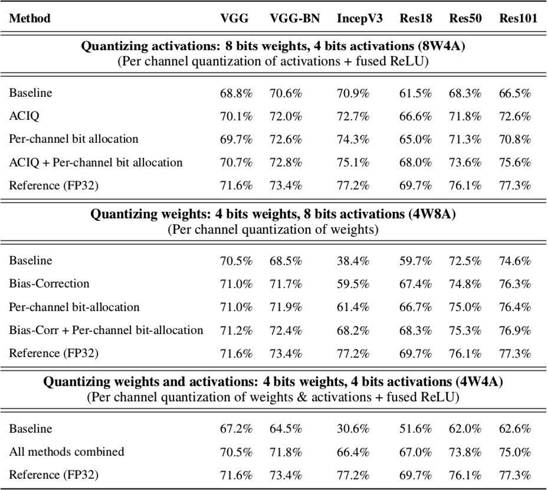
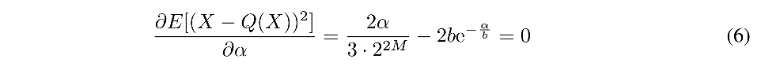
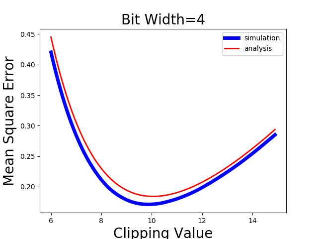
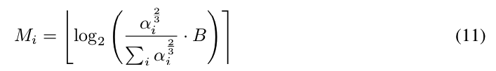
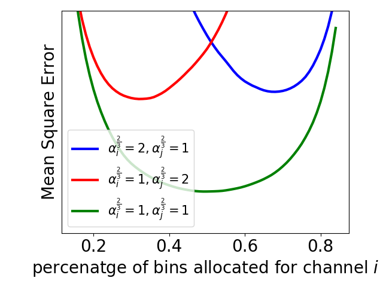
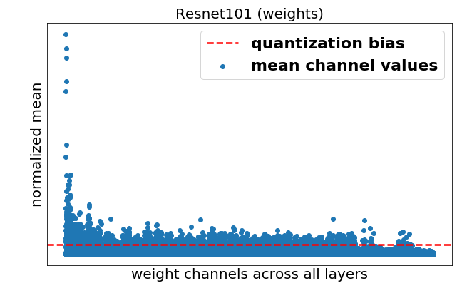
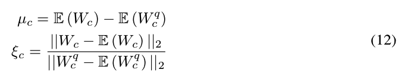
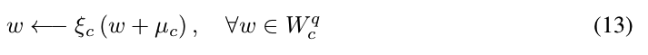
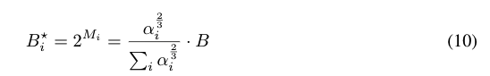

# cnn-quantization

## Dependencies
- python3.x
- [pytorch](<http://www.pytorch.org>)
- [torchvision](<https://github.com/pytorch/vision>) to load the datasets, perform image transforms
- [pandas](<http://pandas.pydata.org/>) for logging to csv
- [bokeh](<http://bokeh.pydata.org>) for training visualization
- [scikit-learn](https://scikit-learn.org) for kmeans clustering
- [mlflow](https://mlflow.org/) for logging
- [tqdm](https://tqdm.github.io/) for progress


## HW requirements
NVIDIA GPU / cuda support

## Data
- To run this code you need validation set from ILSVRC2012 data
- Configure your dataset path by providing --data "PATH_TO_ILSVRC" or copy ILSVRC dir to ~/datasets/ILSVRC2012.
- To get the ILSVRC2012 data, you should register on their site for access: <http://www.image-net.org/>

## Prepare environment
- Clone source code
```
git clone https://github.com/submission2019/cnn-quantization.git
cd cnn-quantization
```
- Create virtual environment for python3 and activate:
```
virtualenv --system-site-packages -p python3 venv3
. ./venv3/bin/activate
```
- Install dependencies
```
pip install torch torchvision bokeh pandas sklearn mlflow tqdm
```

## Building cuda kernels for GEMMLOWP
To improve performance GEMMLOWP quantization was implemented in cuda and requires to compile kernels.
- build kernels
```
cd kernels
./build_all.sh
cd ../
```

### Run inference experiments
**Post-training quantization of Res50**<br/><br/>
>*Note that accuracy results could have 0.5% variance due to data shuffling.*

- Experiment W4A4 naive:
```
python inference/inference_sim.py -a resnet50 -b 512 -pcq_w -pcq_a -sh --qtype int4 -qw int4
```
>* Prec@1 62.154 Prec@5 84.252

- Experiment W4A4 + ACIQ + Bit Alloc(A) + Bit Alloc(W) + Bias correction:
```
python inference/inference_sim.py -a resnet50 -b 512 -pcq_w -pcq_a -sh --qtype int4 -qw int4 -c laplace -baa -baw -bcw
```
>* Prec@1 73.330 Prec@5 91.334


<br/>

## ACIQ: Analytical Clipping for Integer Quantization

We solve eq. 6 numerically to find optimal clipping value &alpha; for both Laplace and Gaussian prior.<br/>


Solving eq. 6 numerically for bit-widths 2,3,4 results with optimal clipping values of 2.83*b, 3.86*b, 5.03*b respectively, where b is deviation from expected value of the activation.

Numerical solution source code:
[mse_analysis.py](mse_analysis.py)
<br/>
<br/>

## Per-channel bit allocation

Given a quota on the total number of bits allowed to be written to memory, the optimal bit width assignment Mi for channel i according to eq. 11.<br/>
<br/>
[bit_allocation_synthetic.py](bit_allocation_synthetic.py)<br/>
<br/>
<br/>

## Bias correction
We observe an inherent bias in the mean and the variance of the weight values following their quantization.<br/>
[bias_correction.ipynb](bias_correction.ipynb)<br/>
<br/>
We calculate this bias using equation 12.<br/>
<br/>
Then, we compensate for the bias for each channel of W as follows:<br/>
<br/>
<br/>


## Quantization
We use GEMMLOWP quantization scheme described [here](https://github.com/google/gemmlowp/blob/master/doc/quantization.md).
We implemented above quantization scheme in pytorch. We optimize this scheme by applying ACIQ to reduce range and optimally allocate bits for each channel.

Quantization code can be found in [int_quantizer.py](pytorch_quantizer/quantization/qtypes/int_quantizer.py)
<br/><br/>

## Additional use cases and experiments
### Inference using offline statistics
Collect statistics on 32 images
```
python inference/inference_sim.py -a resnet50 -b 1 --qtype int8 -sm collect -ac -cs 32
```
Run inference experiment W4A4 + ACIQ + Bit Alloc(A) + Bit Alloc(W) + Bias correction using offline statistics.
```
python inference/inference_sim.py -a resnet50 -b 512 -pcq_w -pcq_a --qtype int4 -qw int4 -c laplace -baa -baw -bcw -sm use
```
>* Prec@1 74.2 Prec@5 91.932
<br/>

### 4-bit quantization with clipping thresholds of 2 std
```
python inference/inference_sim.py -a resnet50 -b 512 -pcq_w -pcq_a -sh --qtype int4 -c 2std
```
>* Prec@1 15.440 Prec@5 34.646

### ACIQ with layer wise quantization
```
python inference/inference_sim.py -a resnet50 -b 512 --qtype int4 -c laplace -sm use
```
>* Prec@1 71.404 Prec@5 90.248

## Bin allocation and Variable Length Codding
Given a quota on the total number of bits allowed to be written to memory, the optimal number of bins Bi for channel i derived from eq. 10.<br/>
<br/>

We evaluate the effect of huffman codding on activations and weights by mesuaring average entropy on all layers.

```
python -a vgg16 -b 32 --device_ids 4 -pcq_w -pcq_a -sh --qtype int4 -qw int4 -c laplace -baa -baw -bcw -bata 5.3 -batw 5.3 -mtq -me -ss 1024
```
> * Prec@1 70.801 Prec@5 91.211
>
> Average bit rate: avg.entropy.act - 2.215521374096473
